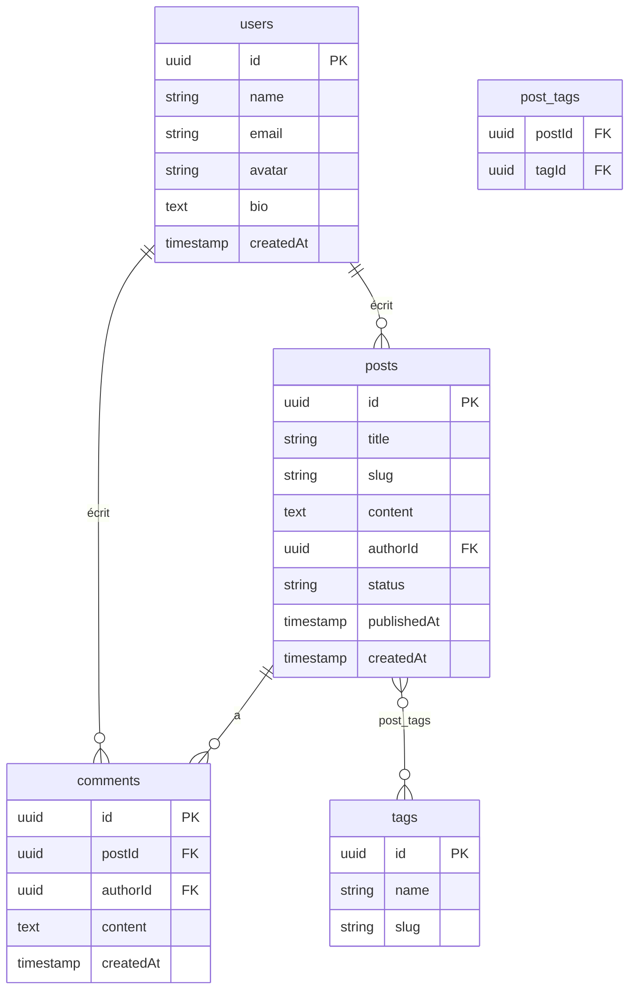

# BlogMigrate

<div align="center">

**Une application blog pleinement fonctionnelle, construite pour illustrer une vraie migration de base de données — de MongoDB vers Supabase (PostgreSQL) — sans qu'une seule ligne de l'interface ne change.**

[](https://nextjs.org)
[](https://www.typescriptlang.org)
[](https://www.mongodb.com)
[](https://supabase.com)
[](https://www.prisma.io)
[](https://playwright.dev)

</div>

---

## Qu'est-ce que ce projet ?

BlogMigrate est une application blog — 50 auteurs, 500 articles, 2 816 commentaires, système de tags complet — initialement construite sur **MongoDB**, puis migrée intégralement vers **Supabase (PostgreSQL)** via Prisma.

Chaque étape de la migration est conservée dans l'historique git : conception du schéma relationnel, script de transformation des données, adaptation du code applicatif, et suite de validation. Le contenu (titres, corps d'articles) est généré par Faker.js — texte factice de type Lorem Ipsum, pas un vrai contenu éditorial.

---

## Pourquoi ce projet

Migrer une base documents vers une base relationnelle est l'une des tâches les plus fréquentes — et les plus risquées — en ingénierie backend. Trois problèmes structurels rendent l'exercice intéressant :

| Pattern MongoDB | Équivalent SQL | Le défi |
|---|---|---|
| `posts.author` (ObjectId ref) | `posts.authorId` FK → `users` | Convertir des ObjectId Mongo en UUID Postgres, en gardant la correspondance |
| `posts.tags: string[]` | `tags` + table de jonction `post_tags` | Dédoublonner les tags, gérer la relation plusieurs-à-plusieurs |
| `posts.comments: [{...}]` | table `comments` avec FK | Aplatir un tableau de sous-documents imbriqués en lignes indépendantes |

---

## Architecture

### Avant — Collections MongoDB

```
users               posts
─────────           ──────────────────────────────────
_id: ObjectId       _id: ObjectId
name: String        title: String
email: String       slug: String
avatar: String      content: String
bio: String          author: ObjectId  ──→  users._id
createdAt: Date     tags: ["js", "react", ...]
                    comments: [
                      { author: ObjectId, content, createdAt },
                      ...
                    ]
                    status: "published" | "draft"
                    publishedAt: Date

tags (collection séparée, pour référence)
─────────
_id: ObjectId
name: String
slug: String
```

### Après — PostgreSQL / Supabase



---

## La migration en 4 étapes

### 1. Seed MongoDB
Génère des données réalistes avec Faker — 50 utilisateurs, 500 articles, ~2 800 commentaires imbriqués.
```bash
docker-compose up -d   # MongoDB sur le port 27017
npm run seed
```

### 2. Concevoir le schéma Supabase
`prisma/schema.prisma` définit les tables cibles (`users`, `posts`, `comments`, `tags`, `post_tags`). La migration Prisma est appliquée directement sur Supabase :
```bash
npx prisma migrate dev --name init
```

### 3. Exécuter le script de migration
`migration/migrate.ts` se connecte aux deux bases simultanément, transforme chaque document et insère les données par lots de 100. Une table de correspondance en mémoire (ObjectId Mongo → UUID Postgres) résout toutes les clés étrangères. Le script vide d'abord les tables Postgres (dans l'ordre inverse des dépendances) avant de réinsérer — il est donc rejouable sans risque.
```bash
npm run migrate
```
**Résultat réel observé :**
```
✓ 50 users migrés
✓ 50 tags migrés
✓ 500 posts migrés
✓ 2816 commentaires migrés
✓ 2278 relations post_tags migrées
```

### 4. Valider — zéro perte de données
`migration/validate.ts` croise les deux bases :
- Les compteurs de lignes correspondent sur chaque table
- Aucun commentaire orphelin, aucun post sans auteur (intégrité référentielle via requêtes SQL `LEFT JOIN`)
- 5 articles comparés un par un (titre, auteur, nombre de commentaires) entre Mongo et Postgres
```bash
npm run validate
```
**Résultat réel observé :** SUCCÈS — 50 users, 50 tags, 500 posts, 2 816 comments, 0 orphelin, 5/5 articles identiques.

---

## Défis techniques

**Documents imbriqués → table relationnelle**
Les commentaires vivaient comme sous-documents dans `posts.comments[]`. Il a fallu les aplatir en lignes de la table `comments`, chacune portant une FK vers son post d'origine — perdue l'imbrication, gagnée la possibilité de requêter les commentaires indépendamment des articles.

**Relation plusieurs-à-plusieurs**
`posts.tags` était un simple tableau de chaînes (`["js", "react"]`), dupliqué sur chaque article. Côté SQL, il fallait dédoublonner les tags en une table unique puis peupler une table de jonction `post_tags` — avec gestion des doublons (`skipDuplicates`) au cas où un même tag apparaîtrait plusieurs fois sur un article.

**Mapping d'identifiants**
MongoDB utilise des `ObjectId`, Postgres des `UUID` — deux formats incompatibles. La solution : générer un nouvel UUID pour chaque ligne migrée et maintenir des `Map<string, string>` en mémoire (Mongo ID → UUID Postgres) pour résoudre les clés étrangères au moment de l'insertion, dans l'ordre users → tags → posts → comments → post_tags.

**Filtres Prisma sur relations obligatoires**
Prisma interdit `where: { relation: null }` sur une relation non-nullable (erreur TypeScript à la compilation). Les contrôles d'intégrité référentielle (`validate.ts`) ont donc été écrits en SQL brut via `prisma.$queryRaw`, avec des `LEFT JOIN ... WHERE x.id IS NULL`.

**Connectivité du pooler Supabase (free tier)**
Le pooler de connexion Supabase (`pooler.supabase.com:6543`) présente des coupures TCP intermittentes en environnement gratuit (`Can't reach database server`, erreur Prisma P1001). Diagnostiqué comme un problème d'infrastructure côté Supabase (l'API REST restait joignable pendant les coupures) — pas un bug applicatif. Une simple relance résout le problème.

---

## Tests

- **Validation de migration** (`npm run validate`) : compare les compteurs et l'intégrité référentielle entre MongoDB et Postgres. ✅ SUCCÈS — aucune divergence détectée.
- **Tests E2E Playwright** (`npm run test:e2e`) : vérifie que la liste d'articles s'affiche avec le bon nombre d'entrées, et qu'une page article affiche correctement l'auteur, les tags et les commentaires. ✅ 2/2 tests passés.

> Note environnement : Playwright est configuré pour utiliser le Chrome installé localement (`channel: "chrome"` dans `playwright.config.ts`) plutôt que de télécharger son propre Chromium, en raison d'une restriction réseau bloquant `cdn.playwright.dev` sur l'environnement de développement.

---

## Démarrage rapide

**Prérequis :** Node 18+, Docker

```bash
git clone https://github.com/BanDev01/BlogMigrate.git
cd BlogMigrate

npm install

# Démarrer MongoDB
docker-compose up -d

# Copier les variables d'environnement
cp .env.example .env
# → renseigner MONGODB_URI, DATABASE_URL, DIRECT_URL, NEXT_PUBLIC_SUPABASE_*

# Peupler MongoDB avec des données factices
npm run seed

# Lancer l'app (mode MongoDB)
npm run dev

# Appliquer le schéma Prisma sur Supabase
npx prisma migrate dev --name init

# Migrer les données vers Supabase
npm run migrate

# Valider l'intégrité de la migration
npm run validate

# Tests E2E
npm run test:e2e
```

---

## Variables d'environnement

```bash
# MongoDB (Docker local)
MONGODB_URI=mongodb://localhost:27017/blogmigrate

# Supabase / Prisma (doivent être dans .env, pas .env.local — Prisma ne lit que .env)
DATABASE_URL=postgresql://...
DIRECT_URL=postgresql://...
NEXT_PUBLIC_SUPABASE_URL=https://xxx.supabase.co
NEXT_PUBLIC_SUPABASE_ANON_KEY=eyJ...
```

---

## Structure du projet

```
BlogMigrate/
├── docker-compose.yml          # MongoDB local
├── prisma/
│   └── schema.prisma           # Schéma cible (Supabase/PostgreSQL)
├── migration/
│   ├── migrate.ts              # Transfert de données MongoDB → Supabase
│   └── validate.ts             # Validation croisée entre les deux bases
├── scripts/
│   └── seed.ts                 # Générateur de données Faker
├── src/
│   ├── app/
│   │   ├── page.tsx            # Liste des articles (paginée)
│   │   └── posts/[slug]/
│   │       └── page.tsx        # Détail article + commentaires
│   └── lib/
│       ├── mongodb.ts          # Connexion MongoDB
│       ├── prisma.ts           # Client Prisma (singleton, Supabase)
│       └── models/             # Modèles Mongoose (conservés pour référence)
│           ├── User.ts
│           ├── Post.ts
│           └── Tag.ts
└── tests/
    └── blog.spec.ts            # Tests E2E Playwright
```

---

## Plan de rollback

La migration ne modifie jamais MongoDB — seule la base Postgres est écrite. En cas de problème :

1. `migration/migrate.ts` vide systématiquement les tables Postgres (`post_tags`, `comments`, `posts`, `tags`, `users`, dans cet ordre) avant de réinsérer — relancer `npm run migrate` repart donc toujours d'un état propre, sans accumulation de doublons.
2. Si une migration partielle a échoué en cours de route, il suffit de corriger le problème et de relancer `npm run migrate` : le script repart de zéro côté Postgres.
3. `npm run validate` doit confirmer un SUCCÈS complet avant de considérer la migration comme terminée.
4. La source MongoDB reste intacte et disponible à tout moment comme filet de sécurité — aucune donnée source n'est jamais supprimée ou modifiée par le processus de migration.

---

## Stack technique

| Couche | Technologie |
|---|---|
| Framework | Next.js 16, TypeScript, Tailwind CSS |
| Base source | MongoDB + Mongoose (Docker local) |
| Base cible | Supabase (PostgreSQL) + Prisma ORM v5 |
| Génération de données | @faker-js/faker |
| Tests E2E | Playwright |
| Infra locale | Docker + docker-compose |
