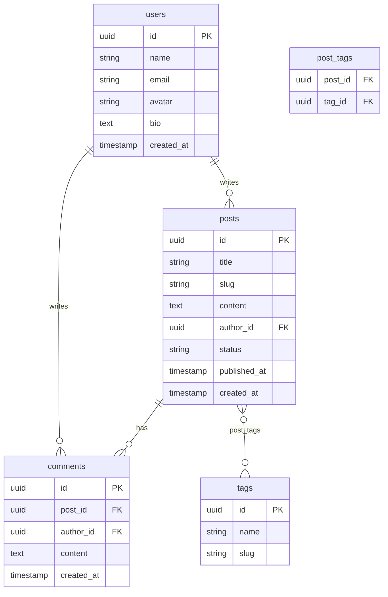

# BlogMigrate

<div align="center">

**A fully functional blog platform built to showcase a real-world database migration — from MongoDB to Supabase (PostgreSQL) — without a single line of UI changing.**

[](https://blogmigrate.vercel.app)
[](https://nextjs.org)
[](https://www.typescriptlang.org)
[](https://www.mongodb.com)
[](https://supabase.com)
[](https://www.prisma.io)
[](https://playwright.dev)

</div>

---

## What is this?

BlogMigrate is a production-grade blog application — 500 articles, 50 authors, 3 000+ comments, full tag system — deployed live on Vercel and backed by **Supabase (PostgreSQL)**.

The twist: the app was originally built on **MongoDB**, and this repository documents the complete migration path from document store to relational database. Every step is preserved in the git history: schema design, data transformation script, code adaptation, and validation suite.

> **[→ See it live](https://blogmigrate.vercel.app)**
> Browse articles, read comments, filter by tag — all served from Supabase in production.

---

## Why this project exists

Migrating a document database to a relational one is one of the most common — and most error-prone — tasks in backend engineering. Three problems make it hard:

| MongoDB pattern | SQL equivalent | The challenge |
|---|---|---|
| `posts.author` (ObjectId ref) | `posts.author_id` FK → `users` | Mapping document IDs to relational keys |
| `posts.tags: ["js", "react"]` | `tags` + `post_tags` junction table | Deduplication + many-to-many explosion |
| `posts.comments: [{...}]` | `comments` table with FK | Flattening nested arrays, preserving order |

If you can handle these three, you can handle 90% of real migrations.

---

## Architecture

### Before — MongoDB collections

```
users               posts
─────────           ──────────────────────────────────
_id: ObjectId       _id: ObjectId
name: String        title: String
email: String       slug: String
avatar: String      content: String
bio: String         author: ObjectId  ──→  users._id
createdAt: Date     tags: ["js", "react", ...]
                    comments: [
                      { author: ObjectId, content, createdAt },
                      ...
                    ]
                    status: "published" | "draft"
                    publishedAt: Date
```

### After — PostgreSQL / Supabase



---

## Migration in 4 steps

### 1. Seed MongoDB
Generate realistic data with Faker — 50 users, 500 posts, ~3 000 embedded comments.
```bash
docker-compose up -d   # MongoDB on port 27017
npm run seed           # populate collections
```

### 2. Design the Supabase schema
`prisma/schema.prisma` defines the target tables. One command pushes it to Supabase:
```bash
npx prisma migrate dev --name init
```

### 3. Run the migration script
`migration/migrate.ts` connects to both databases simultaneously, transforms every document, and inserts data in batches of 100. It keeps an in-memory ID map (Mongo ObjectId → Postgres UUID) to resolve all foreign keys.
```bash
npm run migrate
# ✓ 50 users migrated
# ✓ 47 tags deduplicated and inserted
# ✓ 500 posts migrated
# ✓ 3 241 comments flattened and inserted
# ✓ 1 876 post_tags relationships created
```

### 4. Validate — zero data loss
`migration/validate.ts` cross-checks both databases:
- Row counts match on every table
- No orphaned comments (referential integrity)
- Spot-check 5 posts: same title, author, comment count on both sides
```bash
npm run validate
```

---

## Quick start

**Prerequisites:** Node 18+, Docker

```bash
git clone https://github.com/YOUR_USERNAME/BlogMigrate.git
cd BlogMigrate

npm install

# Start MongoDB
docker-compose up -d

# Copy environment variables
cp .env.example .env.local
# → fill in your Supabase credentials

# Seed MongoDB with fake data
npm run seed

# Run the app (MongoDB mode)
npm run dev

# Migrate to Supabase
npm run migrate

# Validate migration integrity
npm run validate

# E2E tests
npm run test:e2e
```

---

## Environment variables

```bash
# MongoDB (local Docker)
MONGODB_URI=mongodb://localhost:27017/blogmigrate

# Supabase
DATABASE_URL=postgresql://...
DIRECT_URL=postgresql://...
NEXT_PUBLIC_SUPABASE_URL=https://xxx.supabase.co
NEXT_PUBLIC_SUPABASE_ANON_KEY=eyJ...
```

---

## Project structure

```
BlogMigrate/
├── docker-compose.yml          # MongoDB local
├── prisma/
│   └── schema.prisma           # Target schema (Supabase/PostgreSQL)
├── migration/
│   ├── migrate.ts              # MongoDB → Supabase data transfer
│   └── validate.ts             # Cross-database validation
├── scripts/
│   └── seed.ts                 # Faker data generator
├── src/
│   ├── app/
│   │   ├── page.tsx            # Article list (paginated)
│   │   └── posts/[slug]/
│   │       └── page.tsx        # Article detail + comments
│   └── lib/
│       ├── mongodb.ts          # MongoDB connection
│       ├── prisma.ts           # Prisma client (Supabase)
│       └── models/             # Mongoose models
│           ├── User.ts
│           ├── Post.ts
│           └── Tag.ts
└── tests/
    └── blog.spec.ts            # Playwright E2E tests
```

---

## Rollback plan

If the migration fails partway through:
1. `npm run migrate -- --rollback` truncates all Supabase tables (safe — source MongoDB is untouched)
2. Fix the issue, re-run `npm run migrate`
3. `npm run validate` confirms integrity before switching traffic

The app can point to either database by toggling `DATA_SOURCE=mongodb|supabase` in `.env.local`.

---

## Tech stack

| Layer | Technology |
|---|---|
| Framework | Next.js 14, TypeScript, Tailwind CSS |
| Deployment | Vercel |
| Source database | MongoDB + Mongoose |
| Target database | Supabase (PostgreSQL) + Prisma ORM |
| Data generation | @faker-js/faker |
| E2E testing | Playwright |
| Local infra | Docker + docker-compose |
